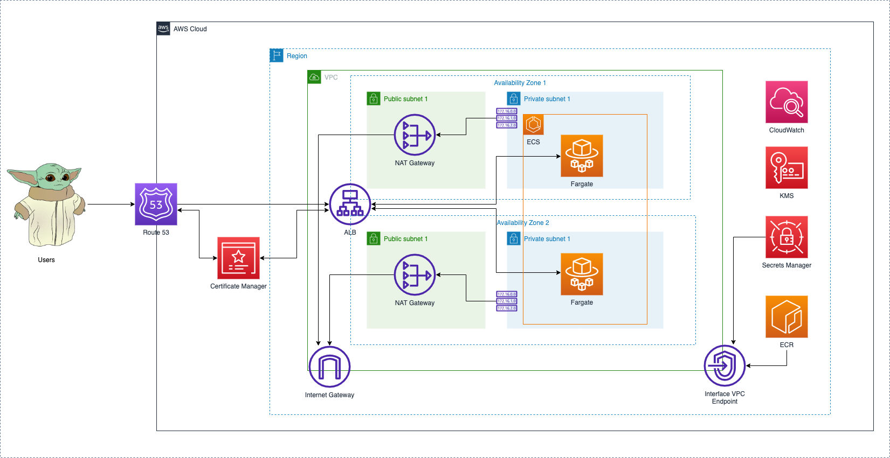

# This project

This project creates a containerized web service project. The project uses [Terraform](https://www.terraform.io/) to define and deploy a containerized Node.js web service on [Amazon Elastic Container Service (Amazon ECS)](https://aws.amazon.com/pm/ecs/). The project deploys a containerized app to an Amazon ECS cluster on AWS Fargate serverless compute. After your workflow runs successfully, the sample web service is publicly available through the Application Load Balancer.

The deployed application can be accessed at https://dev.quest.nbekenov.com/

### Architecture


## Project Structure

`/iac` contains the infrastructure as code (IaC) terraform files.

`/src` contains the application source code

`/test` contains dummy unit tests for application.

`/bin` contains the frontend source code.  

`/.codecatalyst` conatins CodeCatalyst workflows definition

`/scripts` helper scrips used in the workflow

## Prerequisites

- NPM
- Docker
- Terraform

## Getting Started

To get started with the project, follow the steps below:

1. Clone this repository to your local machine
2. Navigate to the project directory
3. Run `npm install` to install the dependencies
4. Run `npm start` to start the application
5. Open your web browser and go to [http://localhost:3000](http://localhost:3000/) to view the app


## Usage with Docker

```
docker build -t quest:latest .
docker run -p 3000:3000 quest:latest
```

## Running Tests

```
npm run build
npm test
```

## CI/CD with CodeCatalyst
This project uses CodeCatalyst for continuous integration and continuous deployment (CI/CD). The `./codecatalyst/workflows/main_branch.yml` file defines the CI/CD pipeline, which includes building the application, running tests, and deploying the application to AWS.

The Amazon CodeCatalyst workflow contains the following actions:
* **Software Composition Analysis (SCA)** - SCA uses [Trivy](https://github.com/aquasecurity/trivy-action) to review the dependencies in the application and to identify known security vulnerabilities.
* **Build** - Build uses [ESLint](https://eslint.org/) and [Jest](https://jestjs.io/) to compile source code, run unit tests and static analysis on code quality, coding standards.
* **Bootstrap** -  Bootstrap create resource for Terraform remote backend. More details [readme.md](iac/bootstrap/readme.md)
* **Package** - Package uses Docker to build the image and Trivy to scan for vulnerabilities in the operating system and in libraries used by the image.
* **Deploy** - Deploy performs a Terraform deployment of the application to the dev environment.

## Infrastructure as Code with Terraform

The IaC code for this project is written in Terraform, and it defines the necessary infrastructure components such as the ECS, ALB, VPC and more [README.md](iac/app_infra/README.md)

## Contributing

To contribute to this project, follow the steps below:

1. Fork this repository
2. Create a new branch (`git checkout -b feature/branch-name`)
3. Make your changes
4. Commit your changes (`git commit -am 'Add some feature'`)
5. Push to the branch (`git push origin feature/branch-name`)
6. Create a new Pull Request

## License

This project is licensed under the MIT License. See the `LICENSE` file for more information.